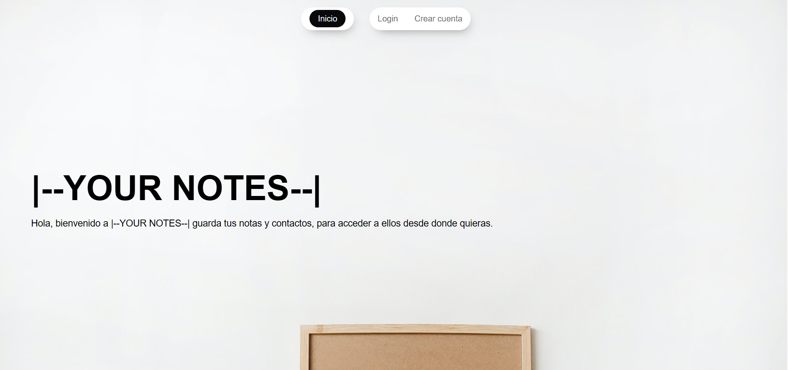
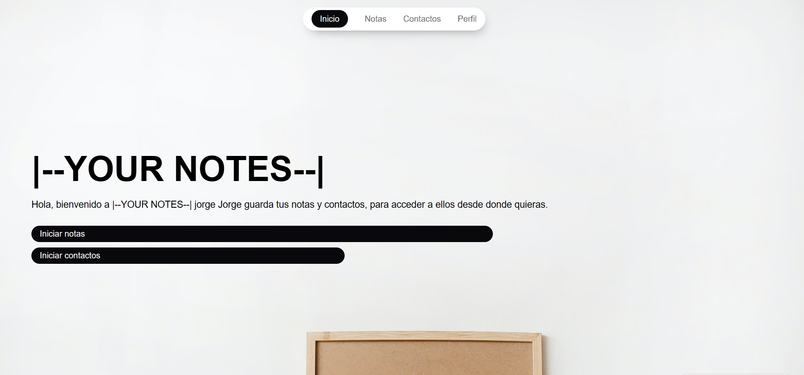
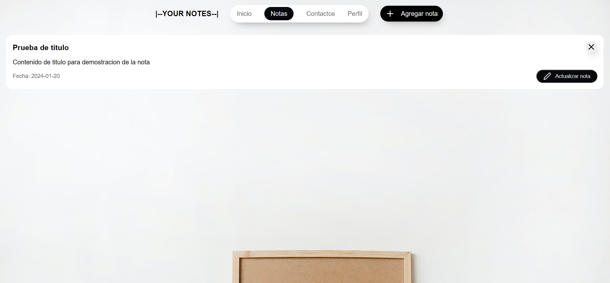
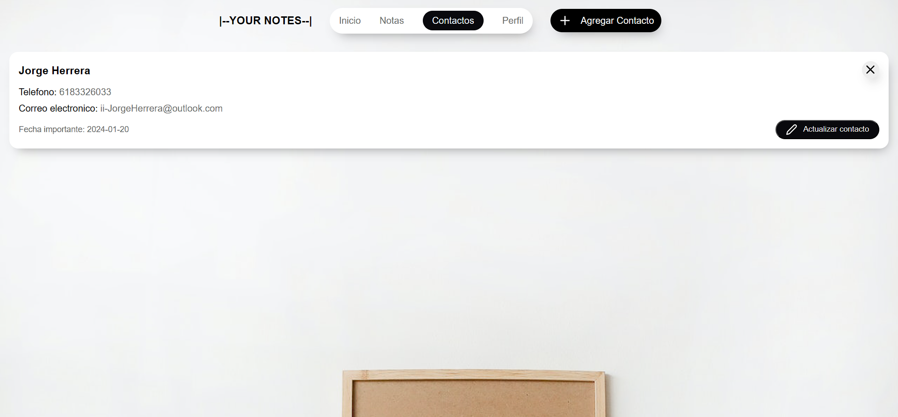

# 🗒️ YOUR-NOTES

**YOUR-NOTES** es una aplicación web desarrollada con tecnologías como **HTML**, **CSS**, **JavaScript**, **PHP** y **MySQL**. Funciona como un bloc de notas digital que permite:

- 🧑‍🤝‍🧑 Gestionar una agenda de contactos  
- 📝 Tomar y organizar notas  
- ⚙️ Editar el perfil del usuario  

El proyecto destaca por su implementación de un sistema **CRUD** sobre una base de datos relacional en MySQL, ofreciendo una experiencia funcional, intuitiva y completa.

---

## 🚪 Pantalla de inicio  


### Descripción  
La pantalla de inicio incluye validación de sesión y restricción de acceso para usuarios no autorizados. Su diseño es sencillo y elegante. Al cerrar el navegador, la sesión se cierra automáticamente, por lo que es necesario iniciar sesión nuevamente.

---

## 🔐 Inicio de sesión  


### Descripción  
Tras iniciar sesión, se presentan dos botones principales que permiten comenzar rápidamente con las actividades disponibles en la aplicación.

---

## 📝 Vista de notas  


### Descripción  
La sección de notas ofrece una interfaz limpia y funcional para visualizar, agregar, editar y eliminar notas. Su diseño facilita la organización y gestión de contenido personal.

---

## 📇 Vista de contactos  


### Descripción  
La sección de contactos permite visualizar información relevante de cada contacto en una lista clara y accesible. También se pueden agregar, modificar y eliminar registros fácilmente, manteniendo una experiencia de usuario fluida y amigable.

---

## ⚙️ Instalación

1. Clona el repositorio:

   ```bash
   https://github.com/GhostJL/---YOUR-NOTES---.git

2. Configura tu entorno local con Apache, PHP y MySQL (puedes usar XAMPP o similar).
3. Importa el archivo .sql en tu gestor de bases de datos MySQL para crear las tablas necesarias.
4. Asegúrate de configurar correctamente las credenciales de conexión en el archivo config.php.
5. Ejecuta el proyecto desde tu navegador accediendo a localhost/YOUR-NOTES.

---

## 🚀 Uso
- Inicia sesión con tus credenciales.
- Accede a las secciones de notas o contactos desde el menú principal.
- Agrega, edita o elimina información según tus necesidades.
- Cierra sesión para proteger tu información.

---

## 🧰 Tecnologías utilizadas

| Tecnología | Uso principal |
|--------------|--------------|
| HTML | Estructura de la interfaz |
| CSS | Estilos y diseño visual |
| JavaScript | Interactividad en el cliente |
| PHP | Lógica del servidor |
| MySQL | Gestión de base de datos |

---

